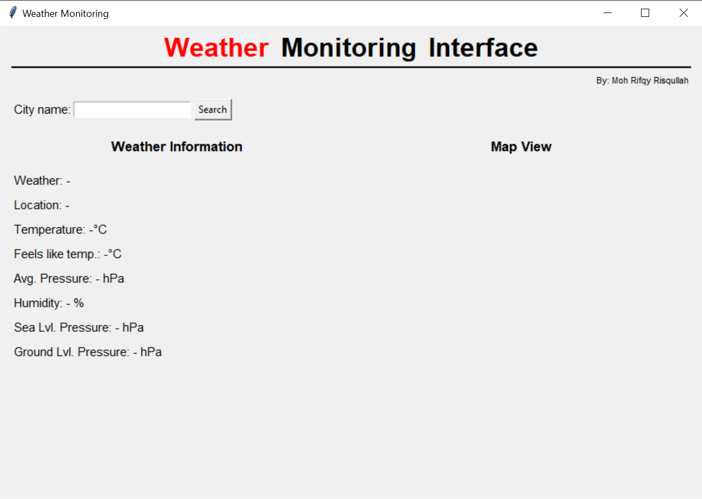
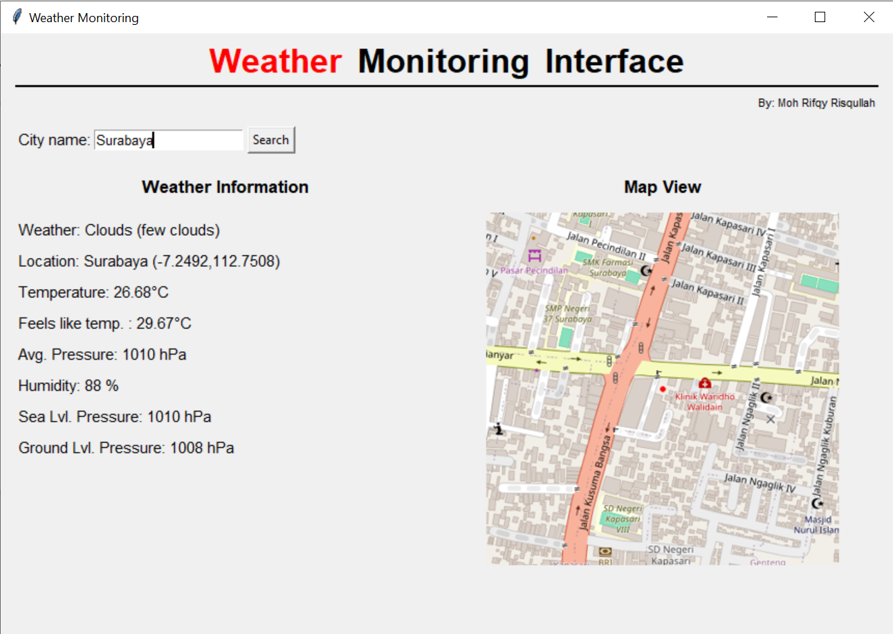

# Weather Monitoring Interface

**Weather Monitoring Interface** is a Python GUI application built with Tkinter that allows users to monitor real-time weather data for any city using the OpenWeather API. It displays key weather metrics such as temperature, humidity, pressure, etc.; and dynamically loads a city map from OpenStreetMap

  

---

## Features

**1. City Name Input**  
Enter a city name to fetch and display live weather information.

**2. Comprehensive Weather Data**   
- Latitude & Longitude
- Temperature (°C)  
- Feels Like Temperature (°C)  
- Humidity (%)  
- Pressure

**3. Automatic Map Display**   
Integrates an image map view of the selected city using OpenStreetMap (as a free alternative to Google Maps).

---

## How To Use

  

- Insert your API Key in `API_KEY_WEATHER` (you can get your API key from [here](home.openweathermap.org/api_keys).
- Run `main.py`.
- Fill the entry with city's name (Example: Jakarta).
- Click `Search` button.
